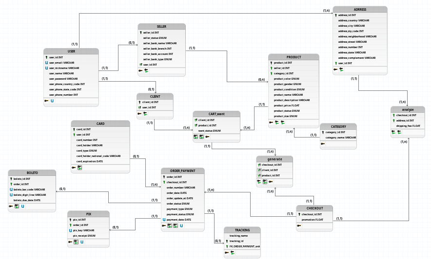

# Data Modeling
## Entity-Relationship Model (ERD)

### Entities

- USER
  - CLIENT
  - SELLER
- ADDRESS
- CATEGORY
- PRODUCT
- CART
- CHECKOUT
- checkout
- PAYMENT
- CARD
- BOLETO
- PIX
- TRACKING

### Attributes

- **USER** (<u>user_id</u>, user_name, user_email, user_nickname, user_password, user_phone(user_phone_country_code, user_phone_state_code, user_phone_number))
- **CLIENT**(<u>client_id</u>, <u>user_id</u>)
- **SELLER**(<u>seller_id</u>, <u>user_id</u>, seller_status, seller_bank_name, seller_bank_account, seller_bank_branch, seller_bank_type)
- **ADDRESS** (<u>address_id</u>, user_id, address_country, address_zip_code, address_state, address_city, address_neighborhood, address_street, address_number, address_complement)
- **CATEGORY**(<u>category_id</u>, category_name)
- **PRODUCT** (<u>product_id</u>, seller_id, category_id, product_name,  product_status, product_description, product_price, product_size, product_color, product_gender, product_condition)
- **CART** (<u>user_id</u>,<u>product_id</u>, want_status)
- **CHECKOUT** (<u>checkout_id</u>, client_id, shipping_fee, {product_id})
- **ORDER** (<u>order_id</u>, checkout_id,  tracking_id,order_status, order_date, order_update_at)
- **TRACKING** (<u>tracking_id</u>, order_id, tracking_status, tracking_updated_at, tracking_location)
- **PAYMENT** (<u>payment_id</u>, order_id, card_id, payment_type, payment_status, payment_date)
- **CARD** (<u>card_id</u>, user_id, card_type, card_holder, card_holder_national_code, card_number, card_expiration)
- **PIX** (<u>pix_id</u>, payment_id, pix_key, pix_receipt)
- **BOLETO** (<u>boleto_id</u>, payment_id, boleto_bar_code, boleto_due_date, boleto_digit_line)

### Relationships

- USER **has** ADDRESS   A USER has one or more ADDRESS(es) (1:N)

- SELLER **sell** PRODUCT   A SELLER sell zero or more PRODUCT(s) (0:N)

- CLIENT **want** PRODUCT   A CLIENT want zero or more PRODUCT(s) (0:1)

- CART **generate** checkout   A CART generate one or more checkout(s) (0:N)

- CHECKOUT **validated_by** PAYMENT   An checkout is validated by one  or more PAYMENT(s) (1:N)

- CLIENT **saves** CARD   A CLIENT may save zero or more CARD(s) (1:N)

- ORDER **may_have** TRACKING   An ORDER may have one TRACKING (1:1)

<!-- USER == especializacao total não exclusiva, usuário pode ser cliente e vendedor também -->

## Entity Relationship Diagram

[Download - conceptual_ERD.brM3](./archive/conceptual_ERD.brM3)

## Logical Data Model (LDM)

[Download - logical_LDM.brM3](./archive/logical_LDM.brM3)

<!-- ## Data Dictionary -->

## Script

- [Physical](./script/db_brecho.sql)
- [Populate](./script/populate.sql)
- [Delete](./script/delete.sql)
  

/
├── backend
│   ├── src/
│   │   ├── schema/
│   │   │   └── authSchema.py
│   │   │   └── userSchema.py
│   │   │   └── addressSchema.py
│   │   ├── database.py           
│   │   ├── models/
│   │   │   ├── __init__.py       
│   │   │   ├── address.py         
│   │   │   └── user.py           
│   │   ├── repositories/
│   │   │   ├── addressRouter.py                
│   │   │   └── userRepository.py         
│   │   ├── routers/
│   │   │   └── userRouter.py           
│   │   │   └── authRouter.py         
│   │   │   └── address.py  
│   │   ├── app.py
│   │   ├── database.py  
│   │   ├── security.py  
│   │   ├── settings.py     
│   └── tests/
│   └── docs/
├── Dockerfile
├── docker-compose.yml
├── .env
├── ...