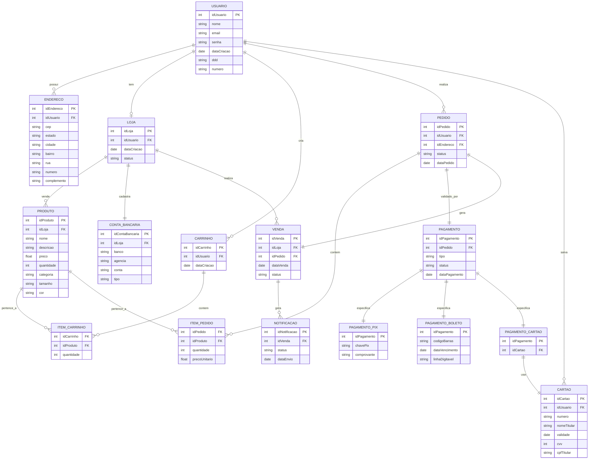

# DER - Diagrama Entidade Relacionamento

```mermaid

erDiagram
    USUARIO ||--o{ ENDERECO : possui
    USUARIO ||--o| LOJA : tem
    USUARIO ||--o{ CARRINHO : cria
    USUARIO ||--o{ PEDIDO : realiza
    USUARIO ||--o{ CARTAO : salva

    LOJA ||--o{ PRODUTO : vende
    LOJA ||--|| CONTA_BANCARIA : cadastra
    LOJA ||--o{ VENDA : realiza

    CARRINHO ||--o{ ITEM_CARRINHO : contem
    PRODUTO ||--o{ ITEM_CARRINHO : pertence_a

    PEDIDO ||--o{ ITEM_PEDIDO : contem
    PRODUTO ||--o{ ITEM_PEDIDO : pertence_a

    PEDIDO ||--|| PAGAMENTO : validado_por
    PAGAMENTO ||--|| PAGAMENTO_PIX : especifica
    PAGAMENTO ||--|| PAGAMENTO_BOLETO : especifica
    PAGAMENTO ||--|| PAGAMENTO_CARTAO : especifica
    PAGAMENTO_CARTAO ||--|| CARTAO : usa

    PEDIDO ||--|| VENDA : gera
    VENDA ||--o{ NOTIFICACAO : gera

    USUARIO {
        int idUsuario PK
        string nome
        string email
        string senha
        date dataCriacao
        string ddd
        string numero
    }

    ENDERECO {
        int idEndereco PK
        int idUsuario FK
        string cep
        string estado
        string cidade
        string bairro
        string rua
        string numero
        string complemento
    }

    LOJA {
        int idLoja PK
        int idUsuario FK
        date dataCriacao
        string status
    }

    PRODUTO {
        int idProduto PK
        int idLoja FK
        string nome
        string descricao
        float preco
        int quantidade
        string categoria
        string tamanho
        string cor
    }

    CARRINHO {
        int idCarrinho PK
        int idUsuario FK
        date dataCriacao
    }

    ITEM_CARRINHO {
        int idCarrinho FK
        int idProduto FK
        int quantidade
    }

    PEDIDO {
        int idPedido PK
        int idUsuario FK
        int idEndereco FK
        string status
        date dataPedido
    }

    ITEM_PEDIDO {
        int idPedido FK
        int idProduto FK
        int quantidade
        float precoUnitario
    }

    PAGAMENTO {
        int idPagamento PK
        int idPedido FK
        string tipo
        string status
        date dataPagamento
    }

    PAGAMENTO_PIX {
        int idPagamento PK
        string chavePix
        string comprovante
    }

    PAGAMENTO_BOLETO {
        int idPagamento PK
        string codigoBarras
        date dataVencimento
        string linhaDigitavel
    }

    PAGAMENTO_CARTAO {
        int idPagamento PK
        int idCartao FK
    }

    CARTAO {
        int idCartao PK
        int idUsuario FK
        string numero
        string nomeTitular
        date validade
        int cvv
        string cpfTitular
    }

    CONTA_BANCARIA {
        int idContaBancaria PK
        int idLoja FK
        string banco
        string agencia
        string conta
        string tipo
    }

    VENDA {
        int idVenda PK
        int idLoja FK
        int idPedido FK
        date dataVenda
        string status
    }

    NOTIFICACAO {
        int idNotificacao PK
        int idVenda FK
        string status
        date dataEnvio
    }


```