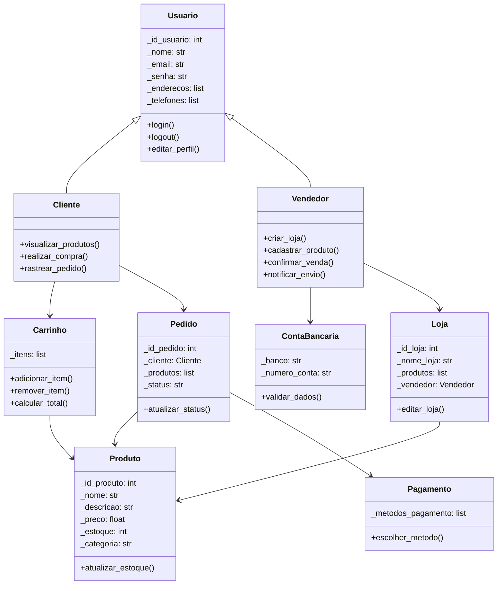

# Diagramas

## Adaptações e Considerações
Levando em conta a necessidade de refator o código originalmente em Java para Python é importante ter algumas considerações sobre alguns conceitos das linguagens.

| Conceito              | Java                                           | Python                                                |
| --------------------- | ---------------------------------------------- | ----------------------------------------------------- |
| Encapsulamento        | Modificadores `private`, `protected`, `public` | Convenções: `_protegido`, `__privado` (name mangling) |
| Tipagem               | Estática                                       | Dinâmica (mas pode usar type hints)                   |
| Pacotes/modularização | `package`, estrutura rígida                    | Módulos (`.py`) e pacotes (pastas com `__init__.py`)  |
| MVC Formal            | Usa diagramas de pacotes/arquitetura formal    | Python tende a ter arquitetura mais leve e flexível   |

## Diagrama UML


## Estrutura

```
project/
├── app/
│   ├── controllers/ 
│   ├── models/ 
│   ├── views/ 
├── static/
├── tests/ 
├── main.py
```
